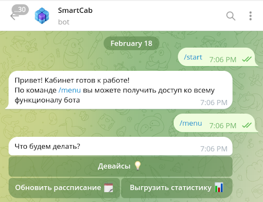

# SmartCab Bot

SmartCab Bot is the **Telegram assistant** for the [SmartCab](https://github.com/smart-cab) smart classroom system.  
It extends the hub’s functionality, giving teachers an easy way to manage classrooms remotely.

## Features

- **Export Statistics**  
  Download lesson and environment data in Excel format for detailed analysis.

- **Classroom Control**  
  Turn on/off devices, lights, computers, and other connected equipment directly from Telegram.

- **Lesson Schedule Management**  
  Upload and update the timetable from within the chat.

- **Security Settings**  
  Configure or reset the hub’s PIN code for private interface sections.

## Technology

- Built with **Python** using [python-telegram-bot](https://github.com/python-telegram-bot/python-telegram-bot).  
- Integrates with SmartCab hub services via REST API.

